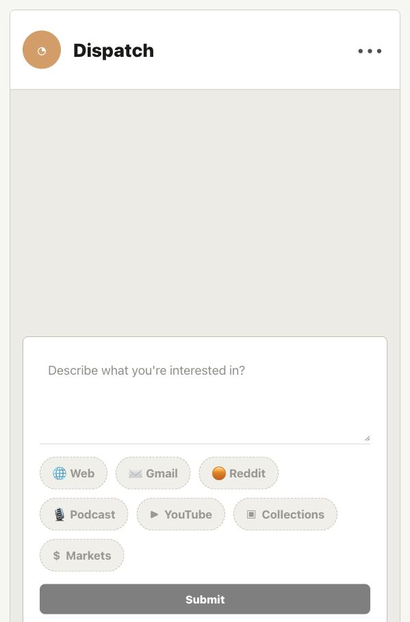
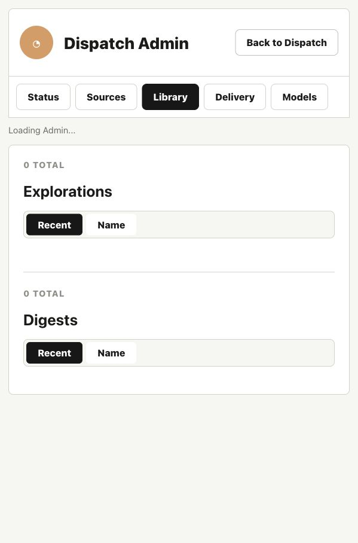

# Morning Dispatch 📰

Morning Dispatch is a local-first personal intelligence app. It aggregates Gmail newsletters, web searches, YouTube videos, local text collections, and market ticker snapshots, transforming them into an AI-curated, newspaper-style HTML digest served on localhost and delivered directly to your inbox.

---

## Key Features

- **Gmail Ingestion**: Ingest newsletter content from configured sender allowlists with strict tracker cleanup.
- **Pluggable Web Discovery**: Integrate Tavily, Brave, or SerpAPI to retrieve discovery-only candidates.
- **YouTube & Podcast Media lane**: Automatically fetch video transcripts and podcast audio files, serving them with interactive transcript readers and modal players.
- **Local Text Collections**: Parse and chunk files (`.txt`, `.md`, `.json`, etc.) from local directories.
- **Market Snapshots**: Select relevant public companies from topics, rendering daily stock performance and sparklines.
- **AI Librarian (Local-First)**: Enrich and summarize articles with local-model endpoints (e.g. oMLX/Gemma), with deterministic fallbacks if offline.
- **Interactive Refinement Chat**: Refine your brief interests, search criteria, must-have keywords, and exclusions.
- **Mobile-Responsive Delivery**: Rendered as a beautiful, premium newspaper-style format, optimized for desktop/mobile browsers, and delivered via Gmail using resolved CSS variables for mail client styling consistency.

---

## Screenshots

### 1. Topic Exploration & Refinement Chat
The interactive Explore panel lets you define your interests in plain English, while the AI assistant critiques and refines specific source queries.


### 2. Premium Newspaper-Style Brief
Curated briefs are rendered in a gorgeous layout featuring lead story cards, importance scoring, custom audio/video players, and a collapsible metadata sidebar.


### 3. Digest Library & Settings Administration
Access your library of past runs, manage schedules, configure Gmail OAuth tokens, and control API allowances.


---

## Runtime Layout

The project folder is clean and safe for version control. All runtime data, database states, and secrets live outside the repository path:

```text
~/.morning-dispatch/data/
~/.morning-dispatch/secrets/
```

---

## Getting Started

### 1. Backend Service Setup
Ensure Python 3.12+ and `uv` are installed:

```bash
uv sync
MORNING_DISPATCH_HOME=~/path/to/runtime \
MORNING_DISPATCH_SECRETS_DIR=~/.morning-dispatch/secrets \
uv run uvicorn backend.app.main:app --reload --host 127.0.0.1 --port 8000
```

### 2. Frontend Development
Run the React/Vite development server (proxies API requests to port 8000):

```bash
npm install
npm run dev
```

### 3. Running Tests
Run the test suite to verify configuration and adapter capabilities:

```bash
uv run pytest
```

### 4. Optional Launchd Configuration (Always-On Service)
You can set up a local daemon to automatically run scheduler checks and update serve mappings behind a Tailscale HTTPS URL:

```bash
bash scripts/install_launchd.sh
```

---

## Integration Adapters

### Web Search
Enable discovery searches by adding one of the following environment keys:
```bash
MORNING_DISPATCH_WEB_SEARCH_PROVIDER=auto  # Options: auto, tavily, brave, serpapi
MORNING_DISPATCH_TAVILY_API_KEY=...
MORNING_DISPATCH_BRAVE_API_KEY=...
MORNING_DISPATCH_SERPAPI_API_KEY=...
```

### YouTube
Enable YouTube searches by providing your API key:
```bash
MORNING_DISPATCH_YOUTUBE_API_KEY=...
MORNING_DISPATCH_YOUTUBE_MAX_RESULTS=15
```

### Local Collections
Point the app to a directory of text/markdown files to inject local context:
```bash
MORNING_DISPATCH_COLLECTIONS_ROOT=~/Documents/Collections
```

### Markets
Runs in simple mode using yahoo finance (`yfinance`) out of the box with no API keys required:
```bash
MORNING_DISPATCH_MARKETS_MODE=simple
```
